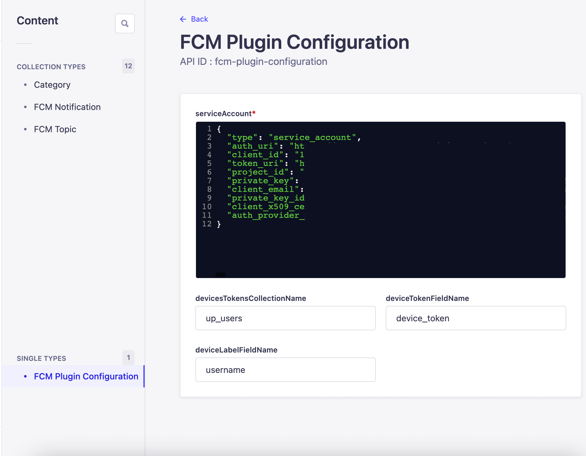
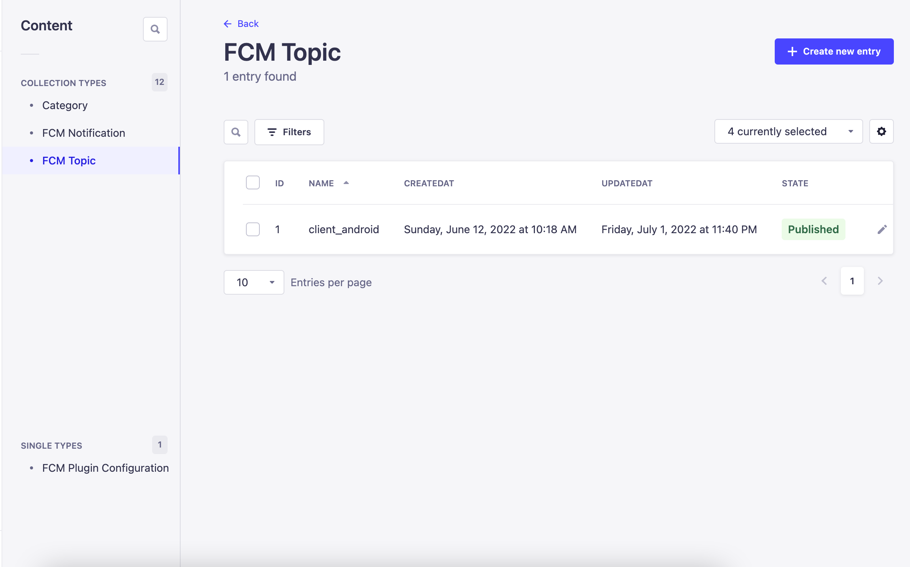
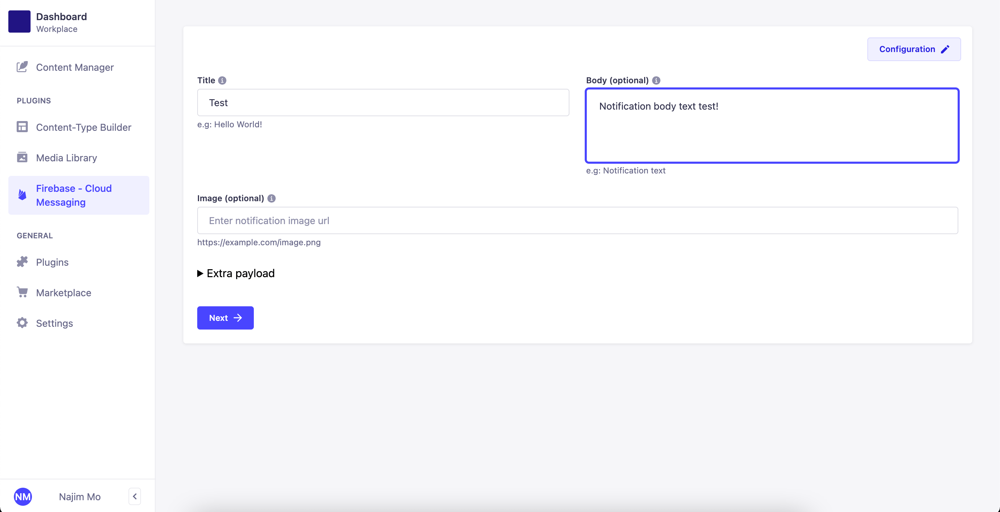
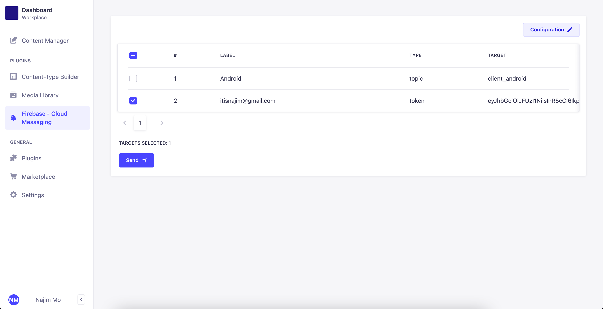
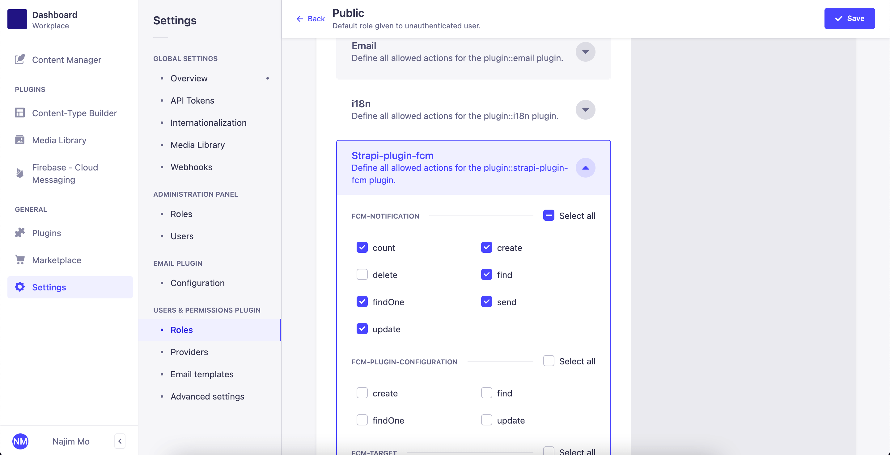

<div align="center">
  
  <h1>Strapi v4 - FCM plugin</h1>
  <p>Send FCM notifications from Strapi.</p>

  <p>
    <a href="https://www.npmjs.org/package/strapi-plugin-fcm">
      
    </a>
    <a href="https://www.npmjs.org/package/strapi-plugin-fcm">
      
    </a>
    <a href="https://codecov.io/gh/itisnajim/strapi-plugin-fcm">
      
    </a>
  </p>
</div>

<br/>

## Installation

### From NPM:
```bash
npm install strapi-plugin-fcm
```

### From YARN:
```bash
yarn add strapi-plugin-fcm
```

### From Git:

1. Clone the plugin into your Strapi project

```bash
cd /<path-to-your-strapi-project>/src

# create plugins folder if not exists
# mkdir plugins

# go to plugins folder
cd plugins

# clone the plugin code into a folder and skip the prefix
git clone https://github.com/itisnajim/strapi-plugin-fcm.git strapi-plugin-fcm
# install dependencies
cd strapi-plugin-fcm && yarn install # or npm install
```

2. Enable the plugin in `<root>/config/plugins.js` .

```javascript
module.exports = {
  // ...
  'strapi-plugin-fcm': {
    enabled: true,
    resolve: './src/plugins/strapi-plugin-fcm' // path to plugin folder
  },
  // ...
}
```

3. Build the plugin

```bash
# back to project root and build the plugin
yarn build # or npm run build
# start
yarn develop # or npm run develop
```

## Configuration
- In the Firebase console, open Settings > [Service Accounts](https://console.firebase.google.com/project/_/settings/serviceaccounts/adminsdk).
- Click Generate New Private Key, then confirm by clicking Generate Key.
- Past the content of your downloaded service account json file into FCM Plugin Configuration > serviceAccount. (like in the picture below, then you may need to restart the server)
<div style="margin: 20px 0" align="center">
  
</div>

- In the same interface 'FCM Plugin Configuration', optionally you can provide where the devices tokens are stored, in the picture example above, I store them in User -> **deviceToken** (strapi generate the users database table with the name up_users).

- Optionally you can provide all the topics you have, in the 'FCM Topic' collection type (via the dashboard or via the api - Post requests).
<div style="margin: 20px 0" align="center">
  
</div>

## Usage
### Via the dashboard
- Enter the notification content.
- Select targets to send to.
- Click send!
<div style="margin: 20px 0" align="center">
  
</div>
<div style="margin: 20px 0" align="center">
  
</div>

### Another way via the dashboard.
- you can create a new entry in the 'FCM Notification' collection type and click publish to send to the FCM.

### Via the api
- First you have to enable and give routes permissions to a specific role or roles.
<div style="margin: 20px 0" align="center">
  
</div>
- Then via an Http Client (axios, ajax, postman, curl or whatever) send a post request with the body data: 

```json
{
    "data": {
        "title": "OKey",
        "body": "Test body",
        "image": "",
        "payload": "",
        "targetType": "topics",
        //or "targetType": "tokens",
        "target": "client_android",
        //or multiple topics "target": "client_android,client_ios",
        //or "target": "eyJhbGciOiJFUzI1...",
        //publishedAt: null //<<- uncomment this if you want to just add an entry as a draft to 'FCM Notification' collection without publishing and sending FCM.
    }
}
```

- You can send an array too:
```json
{
    "data": [{...entry1}, {...entry2}, {...entry3}, ...]
}
```

## Trick
If you have saved the entries in the FCM Notification collection as drafts, you can scheduled them to be sent to FCM at a later time.
- [Scheduled publication](https://docs.strapi.io/developer-docs/latest/guides/scheduled-publication.html)
- [strapi-plugin-publisher
](https://github.com/ComfortablyCoding/strapi-plugin-publisher)

<br/>

## References

- [Strapi v4 developer documentation](https://docs.strapi.io/)
